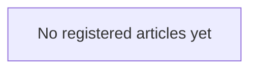

# Joel Articles meta-map

This is the repository-wide visual index of registered articles, explicit interlinks, deduplication relationships, and accepted interlink opportunities. It does not replace `articles/INDEX.json` or article-local authority.

No articles are registered yet.

When an article is registered, add exactly one `<!-- article-id: <article-id> -->` marker and one corresponding graph node in the same change. Add relationship edges only when the editorial relationship is real and useful.
