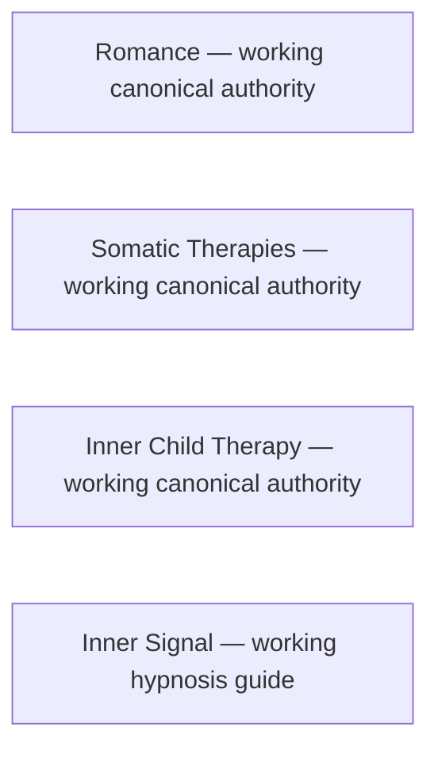

# Joel Articles meta-map

This is the repository-wide visual index of registered articles, explicit interlinks, deduplication relationships, and accepted interlink opportunities. It does not replace `articles/INDEX.json` or article-local authority.

<!-- article-id: romance -->
<!-- article-id: somatic-therapies -->
<!-- article-id: inner-child-therapy -->
<!-- article-id: inner-signal -->

Romance and Somatic Therapies are registered working articles. No direct cross-article edge between them is currently established. Add relationship edges only when a real and useful editorial relationship is confirmed; do not infer one from generic topic overlap.

Inner Child Therapy is registered as a working source authority. Its current raw Substack master is under active reconciliation with earlier humanization decisions; no cross-article edge is established merely from topic overlap.

Inner Signal is registered from the explicitly identified owner editor source and authorized sleep-only derivative. Its app-reference research remains distinct from article authority and actual app implementation.

Inner Signal r03 synchronized its companion-method content against Joel's 2026-09-11 inner-child companion snapshot (`articles/inner-signal/source/inner-child-owner-20260911.md`), which predates the 2026-09-20 registered Inner Child Therapy master. That is a recorded source dependency, not an owner-confirmed editorial edge, so no Mermaid edge is drawn yet. Whether later Inner Child source edits require an Inner Signal re-synchronization is an open owner question.
