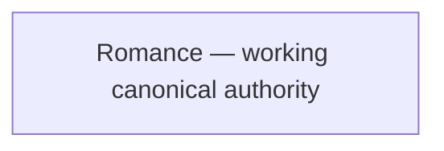

# Joel Articles meta-map

This is the repository-wide visual index of registered articles, explicit interlinks, deduplication relationships, and accepted interlink opportunities. It does not replace `articles/INDEX.json` or article-local authority.

<!-- article-id: romance -->

Romance is currently the only registered article. Add cross-article relationship edges only when another registered article creates a real and useful editorial relationship.
