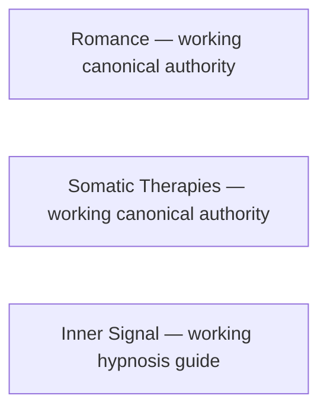

# Joel Articles meta-map

This is the repository-wide visual index of registered articles, explicit interlinks, deduplication relationships, and accepted interlink opportunities. It does not replace `articles/INDEX.json` or article-local authority.

<!-- article-id: romance -->
<!-- article-id: somatic-therapies -->
<!-- article-id: inner-signal -->

Romance and Somatic Therapies are registered working articles. No direct cross-article edge between them is currently established. Add relationship edges only when a real and useful editorial relationship is confirmed; do not infer one from generic topic overlap.

Inner Signal is registered from the explicitly identified owner editor source and authorized sleep-only derivative. Its app-reference research remains distinct from article authority and actual app implementation.
