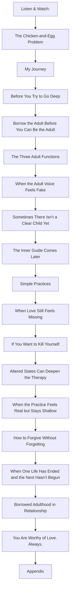
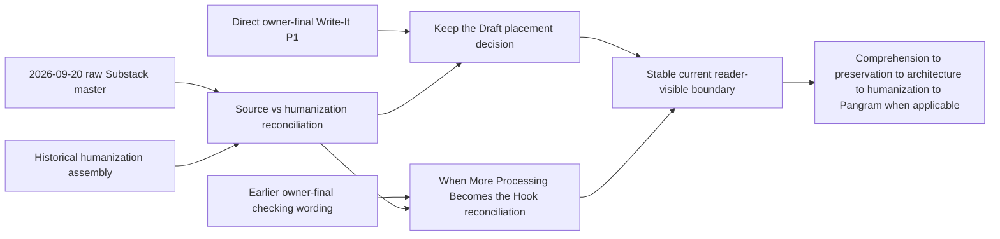

# Inner Child Therapy architecture

<!-- article-id: inner-child-therapy -->

Indexes: articles/inner-child-therapy/CURRENT-STATE.md + articles/inner-child-therapy/master.html

This graph indexes the exact registered working Substack source. It does not imply that every current paragraph has completed humanization, citation review, or owner-final review. Direct current Joel corrections outrank the graph and are reconciled through current state/owner locks.

## Overview

## Active reconciliation dependencies

## Authority / placement notes

- master.html is exact current raw-source authority, not whole-article owner-final prose.
- Historical humanization files are derived evidence, not competing masters.
- Joel's direct owner-final Write-It P1 is higher semantic authority but absent from the raw source and remains placement-reconciliation pending.
- The new checking section occupies functions previously held by owner-final evaluation/stop prose. Do not decide that conflict from timestamp or detector status alone.
- Native/editor object order is indexed in SOURCE-STRUCTURE-INVENTORY-20260920.json.
- No publication export is registered.

## Update rule

Update this file whenever section order, protected-function placement, owner supersession routing, or the real stopping point changes. Cosmetic wording edits do not require graph churn.
