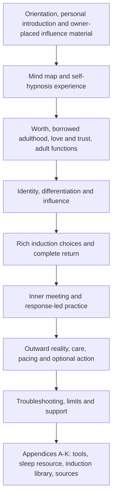

# Inner Signal r03 architecture

<!-- article-id: inner-signal -->

Authority: `articles/inner-signal/CURRENT-STATE.md`, `master.html`, and current owner-source/patch records.



```mermaid
flowchart LR
  companion["Current owner-supplied inner-child guide"] --> child["Localized method synchronization"]
  child --> practice["Responsive practice and troubleshooting"]
  nlp["Appendix B rich language and sensory/state/strategy tools"] --> practice
  raw["Exact current owner editor HTML"] --> native["All native objects and personal placements preserved"]
  practice --> graph["Separate graph candidate plus reference layer"]
  raw --> helper["Canonical Substack transfer generator"]
```

The owner-placed extreme influence account stays in the main guide; owner-deleted triage text is not restored. Sources are in Appendix K and the induction library is Appendix J. Added relational distinctions remain in the main relevant sections, not an appendix relocation. The graph is a derivative candidate and cannot change article authority or installed policy.
