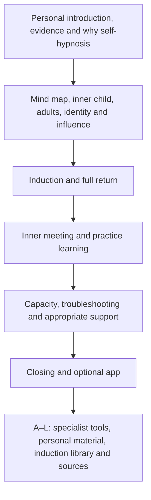
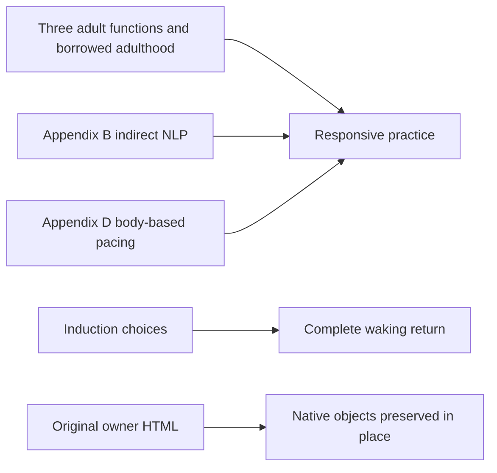

# Inner Signal architecture

<!-- article-id: inner-signal -->

Indexes: `articles/inner-signal/CURRENT-STATE.md` + `articles/inner-signal/master.html`

## Overview

## Important dependencies

## Authority / placement notes
Personal/human and mixed sections remain in place. Only the accepted practice and cue refinements, Appendix H response-check correction and urgent-support timing correction permit substantive changes. Instructional duplicates may be consolidated with explicit destinations; no word target overrides preservation. Research prototype is a model, not a competing master. Sources follow Appendix K without moving its final no-trance block. The full-script slot now teaches responsive practice; the actual inner meeting stays at its source location.
