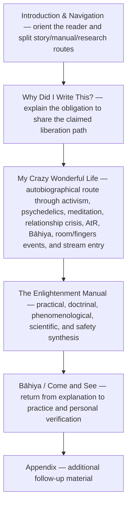
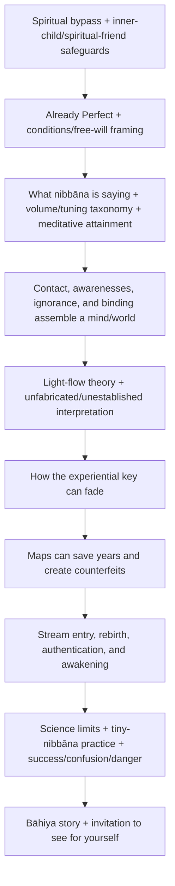
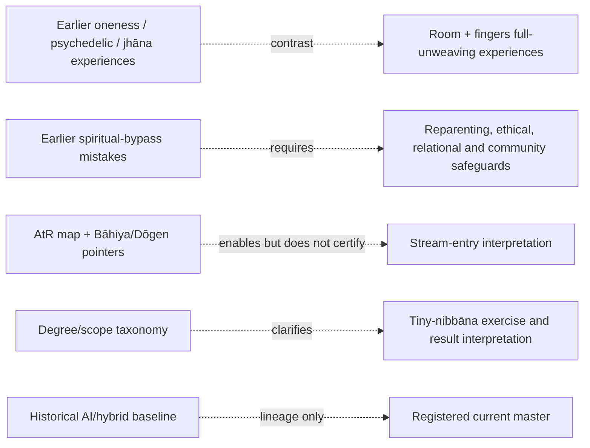

# Nibbāna architecture

<!-- article-id: nibbana -->

Indexes: `articles/nibbana/CURRENT-STATE.md` + `articles/nibbana/master.html`

This graph is a visual index over the exact current Substack editor body. It does not classify paragraph authorship. If it conflicts with registered authority, repair the graph.

## Overview

## Manual drill-down

## Important dependencies

## Authority / placement notes

- The exact supplied current Substack editor body is the working master.
- Current prose has mixed provenance: some passages were written without AI and some were AI-assisted/humanized. This map makes no sentence-level authorship claims.
- The August pre-registration archive is historical provenance only and cannot supersede the current master.
- Native images, videos, audio, comments, buttons, embedded posts, links, captions, and subscription objects are part of the current source structure.
- Protected functions are recorded in `OWNER-LOCKS.json`; no exact passage locks were imposed during import because Joel identified the whole supplied artifact as current while also warning that its authorship is mixed.

## Update rule

Update this file in the same substantive change whenever section order, protected-function placement, owner supersession routing, setup/payoff dependencies, or the real stopping point changes. Cosmetic prose edits do not require graph churn.
