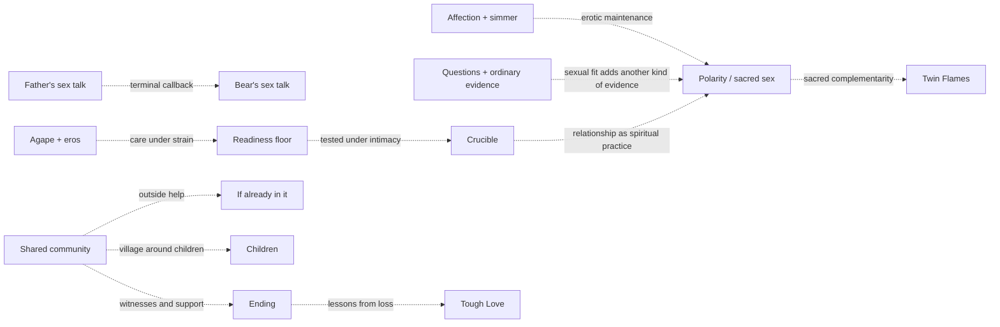
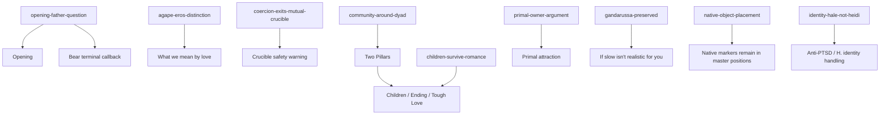

# Romance architecture

<!-- article-id: romance -->

Indexes: `articles/romance/CURRENT-STATE.md` + `articles/romance/master.md`

This graph is a visual index over the registered working Romance authority. If it conflicts with the registered master, owner locks, current state, or current explicit Joel correction, repair the graph rather than the authority.

## Overview

```mermaid
flowchart TD
    opening["Opening — father's age-five sex talk; missing romance curriculum; scope"]
    love["Love — agape + eros; vulnerability and reciprocal wanting"]
    sex["Talk before sex — honesty, affection/simmer, casual-sex responsibility"]
    readiness["Readiness — inner adult, literal parenthood, practical motives, durable love"]
    finding["Finding a partner — community observation and missing courtship middle"]
    starting["Starting right — discernment before attachment; ordinary and sexual evidence"]
    crucible["Crucible — intimacy exposes growth edges; coercion exits mutual frame"]
    maturity["Maturity — role-play vs role capture; complementarity without permanent caregiving"]
    primal["Primal attraction — polarity inside safety; fantasy; sacred making love; muse/director"]
    twin["Twin Flames — de-ontologize sacred complementary connection"]
    community["Two Pillars — the couple needs shared community"]
    choosing["Choosing together — labels, agreements, vows, exclusivity"]
    conscious["Doing consciously — imagination and psychedelic discernment/integration"]
    already["If already in it — trust, honesty, agape, outside help"]
    children["Children — obligations and stable bonds surviving adult romance"]
    ending["Ending consciously — leaving, aftermath, truth, learning from loss"]
    tough["Tough Love — relationship spirit, culture, community synthesis"]
    bear["Bear / Rumi close — return to opening and stop"]

    opening --> love --> sex --> readiness --> finding --> starting --> crucible --> maturity --> primal --> twin --> community --> choosing --> conscious --> already --> children --> ending --> tough --> bear
```

## Important dependencies

## Protected-function routing

## Authority / placement notes

- Current registered working master on PR #46: Romance r23r2, SHA-256 `f1c2b9a3f0f3d9e123c3870ca5d741af8ed99bbf6f138e68b845de04b1a12a2c`; 20,364 Markdown whitespace words.
- Exact reader halves retain the established split topology: Part 1 SHA-256 `620972febec1957403d261c4426c8fbba58763df2c0b78eb87a79da368f1f50b`, 10,296 words; Part 2 SHA-256 `fbbcf64af313488b2ad8bb8969422f5bc85895eca908e41e9f796b2c0724e4eb`, 9,917 words.
- r23r2 was materialized from exact r23 at `u-dont-existDOTcom/pangram-humanization-lab@f4f2d6404e7362441c9ac0969dfc79313bea6ba1` with one authorized local operation. r23 Part 1 remains byte-identical.
- Joel's exact Two Pillars realization is owner-final and locked. It preserves the existing shared-community function while changing only the local thought order: unusually strong couple → mutual friend may see the pattern → counter-limit when both partners are falling apart.
- The local ordering change does not alter section topology, protected-function routing, the shared-community dependency into outside help/children/endings, native-object placement, callbacks, or the article's stopping point; no Mermaid edge changes are required.
- Part 1 retains exact Pangram 4.0 Human `1.0` evidence. Joel reports the exact r23r2 local realization as Human / low confidence and accepts it as good enough. No full Part-2 or whole-article score is claimed.
- The prior registered master, r22 rollback, r23 GUI evidence, rejected r23r1 ordering, and PR #36 remain provenance rather than competing authority.
- Preserve native image, YouTube, Substack preview, share, and button markers at their current source positions unless registered publication-source evidence authorizes a change.
- Copyright/license and publication state are separate owner decisions. Registering the working master does not publish it or grant a license.

## Update rule

Update this file in the same substantive change whenever section order, protected-function placement, owner supersession routing, setup/payoff dependencies, or the real stopping point changes. Cosmetic prose edits do not require graph churn.
