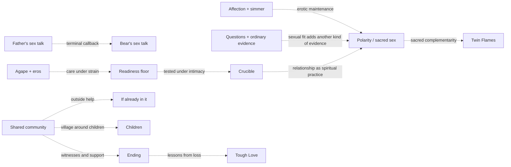
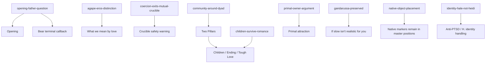

# Romance architecture

<!-- article-id: romance -->

Indexes: `articles/romance/CURRENT-STATE.md` + `articles/romance/master.md`

This graph is a visual index over the registered working Romance authority. If it conflicts with the registered master, owner locks, current state, or current explicit Joel correction, repair the graph rather than the authority.

## Overview

```mermaid
flowchart TD
    opening["Opening — father's age-five sex talk; missing romance curriculum; scope"]
    love["Love — agape + eros; vulnerability and reciprocal wanting"]
    sex["Talk before sex — honesty, affection/simmer, casual-sex responsibility"]
    readiness["Readiness — inner adult, literal parenthood, practical motives, durable love"]
    finding["Finding a partner — community observation and missing courtship middle"]
    starting["Starting right — discernment before attachment; ordinary and sexual evidence"]
    crucible["Crucible — intimacy exposes growth edges; coercion exits mutual frame"]
    maturity["Maturity — role-play vs role capture; complementarity without permanent caregiving"]
    primal["Primal attraction — polarity inside safety; fantasy; sacred making love; muse/director"]
    twin["Twin Flames — de-ontologize sacred complementary connection"]
    community["Two Pillars — the couple needs shared community"]
    choosing["Choosing together — labels, agreements, vows, exclusivity"]
    conscious["Doing consciously — imagination and psychedelic discernment/integration"]
    already["If already in it — trust, honesty, agape, outside help"]
    children["Children — obligations and stable bonds surviving adult romance"]
    ending["Ending consciously — leaving, aftermath, truth, learning from loss"]
    tough["Tough Love — relationship spirit, culture, community synthesis"]
    bear["Bear / Rumi close — return to opening and stop"]

    opening --> love --> sex --> readiness --> finding --> starting --> crucible --> maturity --> primal --> twin --> community --> choosing --> conscious --> already --> children --> ending --> tough --> bear
```

## Important dependencies

## Protected-function routing

## Authority / placement notes

- Source authority was explicitly identified by Joel on 2026-08-20 as `u-dont-existDOTcom/pangram-humanization-lab` branch `agent/romance-primal-crucible-gui-repair-20260817`, whose live PR #36 head resolved unchanged at `8e0d70d0ea51fbcb12e307ed0629ed75ee35ce8c`.
- Registered master SHA-256: `af50b7b93662daf00d484ad83faa0453ff0a2a4fda2867ecfd467166b4c984fe`.
- Reader-visible boundary: 20,496 words, SHA-256 `10359ab2119ffbe9a8a7a4a52cd0c3216bb1a6a2c0bffbd7e66fca01287f17ce`.
- The historical source architecture on PR #36 was useful topology/protected-function evidence but contained a stale displayed master hash and a stale statement that the current 20,496-word candidate was untested. This registered map corrects those state facts rather than copying the historical map as current authority.
- The exact current halves were tested in Pangram 4.0 on 2026-08-20: Part 1 Human fraction `0.9205247164`; Part 2 Human fraction `0.8983033895`. They are diagnostic evidence, not a whole-article score or a 100% Human pass.
- PR #36 and its branch remain provenance only after this import. Future article changes belong in the registered `joel-articles` family.
- Preserve native image, YouTube, Substack preview, share, and button markers at their current source positions unless registered publication-source evidence authorizes a change.
- Copyright/license and publication state are separate owner decisions. Registering the working master does not publish it or grant a license.

## Update rule

Update this file in the same substantive change whenever section order, protected-function placement, owner supersession routing, setup/payoff dependencies, or the real stopping point changes. Cosmetic prose edits do not require graph churn.
