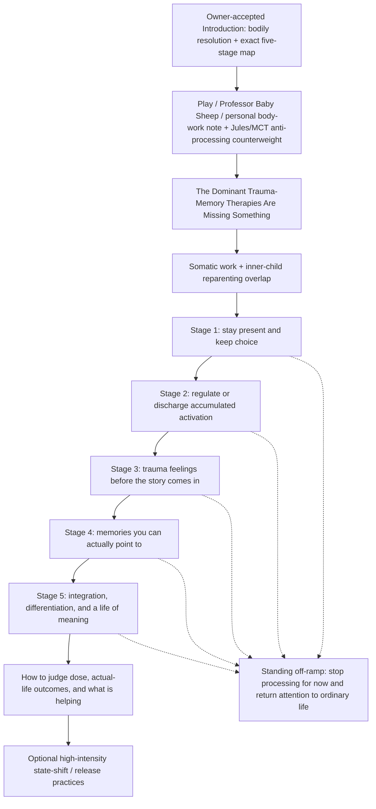

# Somatic Therapies — Architecture

<!-- article-id: somatic-therapies -->

Canonical article id: `somatic-therapies`  
Registered master SHA-256: `1e7e94717f40e7a4de77974a896f600a1bf2769d9c1846cbe84275e136ff5202`

## Governing movement

The Introduction now contains the actual five-stage map in direct owner wording rather than a coarse three-step sequence followed by a later duplicate overview. The controlling revised Introduction is `OWNER-ACCEPTED-INTRODUCTION-20260904.md`. Its five-stage wording comes from Joel's direct owner realization, which he reported Pangram Human / high confidence as a separate bounded text. The larger revised Introduction has not inherited that detector status.

The protected early play/personal material also contains the Jules Evans / Metacognitive Therapy counterweight: sometimes more analysis or therapy is itself maintaining the loop, and the useful move is to stop processing for now and return attention to ordinary life. That does not replace the map; it prevents the map from becoming a mandate to keep doing therapy.

After that early interruption/counterweight, the article explains **why somatic approaches exist at all** by putting them beside dominant trauma-memory therapies rather than treating CBT as a late afterthought.

CBT/exposure retain real strengths: reality testing, behavioral experiments, testing feared predictions, changing avoidance, and cognitive/narrative updating. The accepted argument is also that cognitive/verbal/exposure approaches were **inadequate as a complete account and treatment of trauma**; Somatic Experiencing is the clearest example of a bottom-up approach designed around processes those models can miss.

The methodological synthesis is not `body good / thinking bad`. Bodily signals deserve investigation but not automatic obedience; cognition and reality testing remain useful tools without automatic sovereignty.

Because the five stages are already present in the Introduction, **`The Five Stages at a Glance` is retired as a standalone section.** Do not recreate a second overview between the trauma-memory section and the detailed map. After the trauma-memory section, move through the existing somatic/inner-child overlap and then into the detailed stages.

`Stage` remains the accepted reader-facing label and does not imply a scientifically validated universal five-stage protocol or mandatory lock-step sequence.

## CBT / somatic methodological section

Accepted H1: `The Dominant Trauma-Memory Therapies Are Missing Something`

Placement: after Professor Baby Sheep/head-shaving/Jules-MCT/share material and before the somatic + inner-child overlap / detailed stage route.

Required functions:

- credit mainstream trauma-memory therapies accurately;
- make the inadequacy argument without turning it into `CBT/EMDR/PE are useless`;
- use SE as the clearest methodological/historical contrast;
- preserve the distinction between trauma-memory reprocessing and greater somatic primacy on current sensorimotor/autonomic organization and incomplete defensive responses;
- keep detailed TRE genealogy in its own later location.

Current terminology rule:

- `Exposure` may be used in Joel's broad functional sense of deliberately contacting avoided traumatic material, but that cannot serve as the main contrast because SE also approaches trauma-associated material through titration.
- The stronger distinction is what each therapy is trying to make happen once traumatic material is activated: extinction/inhibitory learning, cognitive restructuring, adaptive memory reprocessing, or sensorimotor/autonomic completion and regulation.

## Five-stage practical route

The Introduction now supplies the map in Joel's exact owner realization:

`Stay present so you can stay with what happens and choose what comes next. Regulate or discharge accumulated activation energy Work with trauma feelings before the story comes in Work with memories you can actually point to: the actual events and the triggering events Integrate, differentiate, and build a life of meaning. Decide your boundaries, direction, relationships, and overall identity.`

Owner report for that bounded realization: Pangram Human / high confidence. Do not transfer that result to different formatting or to the larger Introduction.

Architectural consequences:

- no standalone five-stage overview remains;
- the map applies when doing therapeutic work is helping;
- at any stage, the useful next move may instead be to stop processing for now and return attention to ordinary life;
- one therapy can occupy different stages depending on use, dose, target, and capacity;
- Stage 1 choice includes whether to continue processing at all;
- simultaneous-stage overlap is carried by the inner-child material;
- ordinary living is not reserved for Stage 5;
- sleep / relationships / functioning / freedom / symptom-change assessment is consolidated into the later outcome section.

## Stage-specific structural decisions

### Stage 1 — Stay Present and Keep Choice

Keep Somatic Experiencing, trauma-sensitive/restorative yoga, gentle shaking/TRE, stop/orient/return capacity, and the anti-endless-stabilization warning.

`Keep choice` includes the choice to stop therapeutic processing for now. Stage 1 is not `before CBT`; reality testing can be useful whenever appropriate.

### Stage 2 — Regulate or Discharge Accumulated Activation

Keep EFT, Shaking Qigong/Shaking Medicine, and the Discharge → Settle stack. Keep TRE's specific historical origin with TRE/shaking rather than treating every somatic method as having identical genealogy.

### Stage 3 — Trauma Feelings Before the Story Comes In

The owner map wording is `Work with trauma feelings before the story comes in`. Keep Brainspotting. Sensorimotor Psychotherapy and Focusing are strong bounded inclusion candidates because they add distinct embodied experiments rather than merely more examples of attention to sensation.

### Stage 4 — Memories You Can Actually Point To

The owner map wording is `Work with memories you can actually point to: the actual events and the triggering events`. Keep EMDR, neurological de-armoring support, post-session integration/safety, and the discrete-event exception.

### Stage 5 — Integrate, Differentiate, and Build a Life of Meaning

The owner map wording is `Integrate, differentiate, and build a life of meaning. Decide your boundaries, direction, relationships, and overall identity.`

CBT itself is cross-cutting. Stage 5 is where cognition is used especially for integration, meaning, identity, values, boundaries, agency, relationships, and life direction. It does **not** mean `finally return to ordinary life`; ordinary life is available throughout the map.

## Outcome / evidence destination

`How I Judge Whether Any of This Is Helping` carries:

- immediate, next-day, and multi-day dose assessment;
- symptoms, sleep, irritability, dissociation, pain, relationships, functioning;
- quality of life and person-defined life outcomes;
- whether processing is increasing freedom and life participation or becoming another organizing obsession/rumination loop;
- `stop processing and do ordinary life` as a potentially positive decision rather than automatic avoidance;
- the opposite possibility that `stop analyzing` can itself become avoidance when painful material still needs to be faced;
- evidence-plane distinctions;
- do not confuse intensity with healing;
- avoid reducing psychiatric function to employability.

Retire the one-line recap `Regulation → discharge → processing → integration → meaning`; after the owner five-stage map and Jules/MCT off-ramp it is both redundant and too linear.

## Protected function routing

- Professor Baby Sheep and head-shaving/loveyhuasca remain protected early owner/native material.
- The Jules Evans / MCT addition remains in the protected early `Don’t be so serious, you silly willy!` area and carries the cross-stage anti-rumination/off-ramp function. Exact corrected Substack bytes should be recovered during final source reconciliation rather than reconstructed from Chat.
- Inner-child Nurturer/Protector, borrowed-adulthood, present-focused self-hypnosis, heart-loop, and simultaneous-stage material remain protected.
- Safety warnings stay adjacent to the practice/stage they govern.
- The evidence-plane distinction remains protected but should not be repeated mechanically.
- Sky Hypnosis and Vagal Blitz stay as optional high-intensity practices after the main map, retaining physical-safety and anti-bypassing functions.
- All eight native/editor objects retain exact identity and placement anchors until final Substack/raw-HTML assembly.

## Humanization boundary

Do not turn the five-stage owner realization into polished explanatory cards. The prior assistant realization of the same five functions was owner-reported Pangram AI / high confidence; Joel's replacement realization was Human / high confidence. This is boundary-specific evidence, not a recipe about list length, punctuation, or particular words.

Do not turn the Jules/MCT off-ramp into another therapy assignment, readiness checklist, or sixth stage. Its force is that sometimes **less therapy and more life** is the useful move.

## Stopping point

The article stops after the optional high-intensity-practices section and its existing Sky Hypnosis embed. Do not append a generic synthesis merely because the article has a larger thesis.
