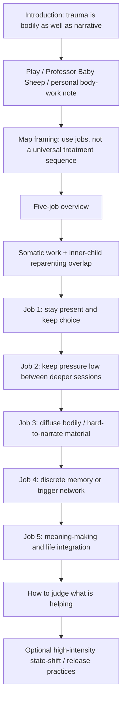

# Somatic Therapies — Architecture

<!-- article-id: somatic-therapies -->

Canonical article id: `somatic-therapies`  
Registered master SHA-256: `1e7e94717f40e7a4de77974a896f600a1bf2769d9c1846cbe84275e136ff5202`

## Governing movement

The article asks what job the nervous system needs help doing now, then places modalities under those jobs without pretending the complete sequence is scientifically validated or mandatory. It moves from basic choice/orientation through ongoing discharge, diffuse processing, discrete-memory work, and integration, while repeatedly preserving the possibility of overlap.

## Protected function routing

- The provisional status of the five-job synthesis belongs in the map framing before the list.
- Professor Baby Sheep and the head-shaving/loveyhuasca material provide real supplied personality early; they are not optional detector decoration.
- Inner-child Nurturer/Protector and heart-loop material belongs before Job 1 so it frames overlap rather than appearing as an afterthought.
- Safety warnings stay adjacent to the practice they govern.
- Evidence-plane distinctions recur where needed and culminate in “How to Judge What Is Helping.”
- Sky Hypnosis and Vagal Blitz remain optional high-intensity practices after the main map, with their own readiness/safety distinctions.
- All eight native/editor objects retain their exact source identity and placement anchors.

## Humanization boundary

The source's repeated `Goal -> Best use -> Not ideal -> caveat` micro-template was intentionally dismantled. Future detector repair must not recreate equalized modality cards, recursive mini-essay closure, or generic therapy voice.

## Stopping point

The article stops after the optional high-intensity-practices section and its existing Sky Hypnosis embed. Do not append a generic summary or inspirational moral merely to create closure.
