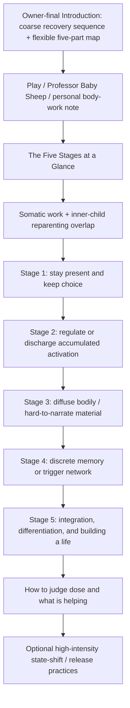

# Somatic Therapies — Architecture

<!-- article-id: somatic-therapies -->

Canonical article id: `somatic-therapies`  
Registered master SHA-256: `1e7e94717f40e7a4de77974a896f600a1bf2769d9c1846cbe84275e136ff5202`

## Governing movement

The Introduction now explains why Joel uses a flexible five-part map. The article therefore does not need a second Map-framing mini-essay. After the protected play/personal material, it shows the five stages compactly and then lets the therapies demonstrate how the map behaves in practice.

`Stage` is the accepted reader-facing label. It does not mean Joel is claiming a scientifically validated universal five-stage protocol or a mandatory lock-step sequence.

## Accepted routing of functions formerly under `This Is a Map, but You Are the Explorer`

- Retire `This Is a Map, but You Are the Explorer` as a standalone explanatory section.
- Keep the five-part list under `The Five Stages at a Glance`.
- State briefly near the overview that one therapy can appear at different stages depending on how it is used; let later concrete examples do most of the explanatory work.
- Move stay-present / voluntary-stop / return-to-ordinary-life questions into Stage 1.
- Move the protected `capacity-building should not become an endless waiting room` warning into Stage 1.
- Carry simultaneous-stage overlap in the existing inner-child material rather than as an abstract prefatory disclaimer.
- Consolidate sleep / relationships / functioning / freedom / symptom-change assessment with the later multi-day dose-assessment passage.
- Preserve the evidence-plane distinction in the Introduction and later evidence-boundary passage rather than repeating it before the stage list.
- Do not repeat a generic universal-sequence disclaimer here; keep modality-specific exceptions where they materially matter.

## Protected function routing

- Professor Baby Sheep and the head-shaving/loveyhuasca material remain protected early personality/source material and are not detector decoration.
- Inner-child Nurturer/Protector, borrowed-adulthood, self-hypnosis, heart-loop, and simultaneous-stage material remain protected overlap functions.
- Safety warnings stay adjacent to the practice or stage they govern.
- Evidence-plane distinctions recur only where they do real work and culminate in the later evidence/outcome assessment.
- Sky Hypnosis and Vagal Blitz remain optional high-intensity practices after the main map, with their own readiness/safety distinctions.
- All eight native/editor objects retain their exact source identity and placement anchors until final Substack/raw-HTML assembly.

## Humanization boundary

Do not recreate the source's repeated `Goal -> Best use -> Not ideal -> caveat` micro-template, a renamed `job` taxonomy, or a second explanatory introduction to the map. Cadence and paragraph duration must follow the thought.

## Stopping point

The article stops after the optional high-intensity-practices section and its existing Sky Hypnosis embed. Do not append a generic summary or inspirational moral merely to create closure.
