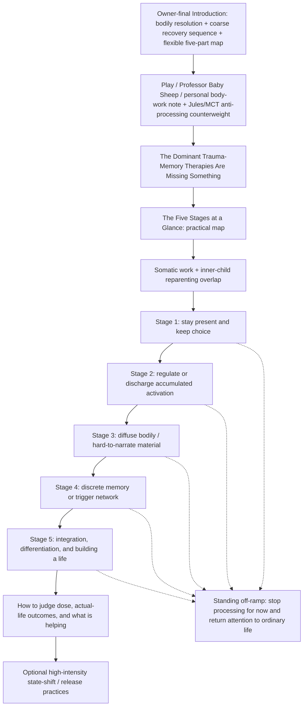

# Somatic Therapies — Architecture

<!-- article-id: somatic-therapies -->

Canonical article id: `somatic-therapies`  
Registered master SHA-256: `1e7e94717f40e7a4de77974a896f600a1bf2769d9c1846cbe84275e136ff5202`

## Governing movement

The Introduction establishes that trauma involves bodily processes and that Joel uses a flexible five-part map. The protected early play/personal material now also contains the Jules Evans / Metacognitive Therapy counterweight: sometimes more analysis or therapy is itself maintaining the loop, and the useful move is to stop processing for now and return attention to ordinary life. That does not replace the map; it prevents the map from becoming a mandate to keep doing therapy.

After that early interruption/counterweight, the article explains **why somatic approaches exist at all** by putting them beside dominant trauma-memory therapies rather than treating CBT as a late afterthought.

CBT/exposure retain real strengths: reality testing, behavioral experiments, testing feared predictions, changing avoidance, and cognitive/narrative updating. The accepted argument is also that cognitive/verbal/exposure approaches were **inadequate as a complete account and treatment of trauma**; if they had exhausted the problem, there would have been much less reason to develop alternative somatic methods. Somatic Experiencing is the clearest example: its own co-authored theoretical account critiques the adequacy of simple conditioning/talk-therapy models for the processes it targets and develops a bottom-up alternative/complement.

The methodological synthesis is not `body good / thinking bad`. Bodily signals deserve investigation but not automatic obedience; cognition and reality testing deserve authority as tools but not automatic sovereignty. The live source-pool formulation is `listen before correcting; then test what needs testing` until Joel separately locks exact publication wording.

The five stages then become the **practical application** of that argument: given multiple ways of interrogating and changing experience, what kind of work seems useful now? They describe therapeutic work **when therapeutic work is actually helping**. At every stage, stopping the processing project for now and doing ordinary life instead remains a legitimate option.

`Stage` remains the accepted reader-facing label and does not imply a scientifically validated universal five-stage protocol or mandatory lock-step sequence.

## CBT / somatic methodological section

Accepted H1: `The Dominant Trauma-Memory Therapies Are Missing Something`

Placement: immediately after Professor Baby Sheep/head-shaving/share material and before `The Five Stages at a Glance`.

Required functions:

- credit mainstream trauma-memory therapies accurately;
- make the inadequacy argument without turning it into `CBT/EMDR/PE are useless`;
- show the epistemic danger of deciding too early that a bodily signal is either truth or noise;
- use SE as the clearest methodological/historical contrast;
- compare different therapies by the question/experiment they bring without building equalized modality cards or implying evidence equivalence;
- keep detailed TRE genealogy in its own later location;
- `CBT Dad` is optional, not required.

Current terminology rule:

- `Exposure` may be used in Joel's broad functional sense of deliberately contacting avoided traumatic material, but that cannot serve as the main contrast because SE also approaches trauma-associated material through titration.
- The stronger distinction is what each therapy is trying to make happen once traumatic material is activated: extinction/inhibitory learning, cognitive restructuring, adaptive memory reprocessing, or sensorimotor/autonomic completion and regulation.

Potential comparison set: CBT, SE, TRE, Focusing, Sensorimotor Psychotherapy, Alexander Technique, 5Rhythms. Focusing and Sensorimotor are candidates for later practical Stage-3 inclusion; Alexander/5Rhythms remain adjacent embodied examples unless a later bounded decision expands them.

## Five-stage practical route

- `The Five Stages at a Glance` follows the CBT/somatic methodological section.
- The map applies when doing therapeutic work is helping. At any stage, the useful next move may instead be to stop processing for now and return attention to ordinary life.
- One therapy can occupy different stages depending on use, dose, target, and capacity; later examples should demonstrate this rather than repeating abstract disclaimers.
- Stay-present / voluntary-stop / return-to-ordinary-life criteria and the `capacity-building should not become an endless waiting room` warning belong in Stage 1.
- Stage 1 choice now explicitly includes whether to continue processing at all.
- Simultaneous-stage overlap is carried by the inner-child material.
- Ordinary living is not reserved for Stage 5. Exercise, relationships, work, play, rest, routine, social life, and forgetting about trauma for a while can be useful anywhere on the map. Stage 5 names more deliberate integration/differentiation/life-direction work.
- Sleep / relationships / functioning / freedom / symptom-change assessment is consolidated into the later dose/outcome section.
- Evidence-plane distinctions recur only where they perform real work rather than in another map-preface disclaimer.

## Stage-specific structural decisions

### Stage 1 — Stay Present and Keep Choice

Keep Somatic Experiencing, trauma-sensitive/restorative yoga, gentle shaking/TRE, stop/orient/return capacity, and the anti-endless-stabilization warning.

`Keep choice` includes the choice to stop therapeutic processing for now. Stage 1 is not `before CBT`; reality testing can be useful whenever appropriate.

### Stage 2 — Regulate or Discharge Accumulated Activation

Keep EFT, Shaking Qigong/Shaking Medicine, and the Discharge → Settle stack. Keep TRE's specific historical origin with TRE/shaking rather than treating every somatic method as having identical genealogy.

### Stage 3 — When the Trauma Is More Body Than Story

Keep Brainspotting. Sensorimotor Psychotherapy and Focusing are strong bounded inclusion candidates because they add distinct embodied experiments rather than merely more examples of attention to sensation.

### Stage 4 — When There Is a Memory You Can Actually Point To

Keep EMDR, neurological de-armoring support, post-session integration/safety, and the discrete-event exception.

### Stage 5 — Integrate, Differentiate, and Build a Life

CBT itself is cross-cutting. Retire the implication that cognitive work becomes legitimate only here. Replace `Light CBT / Narrative Integration` with `Narrative and Cognitive Integration` or later owner-accepted equivalent; Stage 5 is where cognition is used especially for integration, meaning, identity, values, boundaries, agency, and life direction.

Stage 5 does **not** mean `finally return to ordinary life`. Ordinary life is available throughout the map. This stage names deliberate integration and life-building when that is the work that still needs doing.

## Outcome / evidence destination

`How I Judge Whether Any of This Is Helping` now carries a larger function:

- immediate, next-day, and multi-day dose assessment;
- symptoms, sleep, irritability, dissociation, pain, relationships, functioning;
- quality of life and person-defined life outcomes as additional criteria;
- ask whether processing is increasing freedom and life participation or becoming another organizing obsession/rumination loop;
- allow `stop processing and do ordinary life` as a positive outcome/decision rather than treating it automatically as avoidance;
- also distinguish genuine avoidance when painful material still needs to be faced;
- evidence-plane distinctions;
- do not confuse intensity with healing;
- avoid reducing psychiatric function to employability.

Re-evaluate the existing one-line recap `Regulation → discharge → processing → integration → meaning`; it may now be redundant and too linear.

## Protected function routing

- Professor Baby Sheep and head-shaving/loveyhuasca remain protected early owner/native material.
- The Jules Evans / MCT addition remains in the protected early `Don’t be so serious, you silly willy!` area and carries the cross-stage anti-rumination/off-ramp function. Exact corrected Substack bytes should be recovered during final source reconciliation rather than reconstructed from Chat.
- Inner-child Nurturer/Protector, borrowed-adulthood, present-focused self-hypnosis, heart-loop, and simultaneous-stage material remain protected.
- Safety warnings stay adjacent to the practice/stage they govern.
- The evidence-plane distinction remains protected but should not be repeated mechanically.
- Sky Hypnosis and Vagal Blitz stay as optional high-intensity practices after the main map, retaining physical-safety and anti-bypassing functions.
- All eight native/editor objects retain exact identity and placement anchors until final Substack/raw-HTML assembly.

## Humanization boundary

Do not turn the new methodological comparison into a neat taxonomy of seven therapies, a balanced `CBT has X / somatic has Y` mini-essay repeated in parallel, or a renamed checklist. Follow the actual argument and let concrete examples carry distinctions. Cadence and paragraph duration must follow thought movement.

Do not turn the Jules/MCT off-ramp into another therapy assignment, readiness checklist, or sixth stage. Its force is that sometimes **less therapy and more life** is the useful move.

## Stopping point

The article stops after the optional high-intensity-practices section and its existing Sky Hypnosis embed. Do not append a generic synthesis merely because the new article has a larger thesis.
