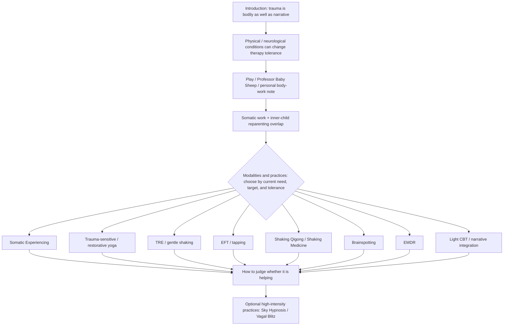

# Somatic Therapies — Architecture

<!-- article-id: somatic-therapies -->

Status: **owner-corrected target architecture on the active Somatic rewrite branch.** The registered r01 master still contains the superseded five-job scaffold until a preservation-clean candidate is promoted.

Canonical article id: `somatic-therapies`  
Registered master SHA-256: `1e7e94717f40e7a4de77974a896f600a1bf2769d9c1846cbe84275e136ff5202`

## Governing movement

The therapies are **modalities/practices, not jobs or stages**. The article may discuss a rough sequencing logic, but only as a practical question of what somebody can tolerate and what kind of material is actually present.

- When somebody is easily overwhelmed, regulation, orientation, body awareness, and stopping/return capacity may need attention before intense memory work.
- Brainspotting can be especially useful when the material is diffuse, bodily, pre-verbal, or hard to narrate.
- EMDR can be a natural fit when there is a discrete memory, flashback, or trigger network.
- Cognitive/narrative work may become more useful once the body is less trapped in present-tense threat.
- None of those observations creates a mandatory sequence. A stable person with a clear target may be ready for EMDR early; one modality can also be used at very different intensities.

The reader should encounter the modalities as actual therapies/practices with their own uses, limitations, and personal observations—not as examples filed under an invented five-part taxonomy.

## Protected function routing

- Professor Baby Sheep and the head-shaving/loveyhuasca material provide real supplied personality early; they are not optional detector decoration.
- Inner-child reparenting remains a recurring article thread rather than a late integration bucket. The main overlap owns the adult/child trust conflict, Nurturer/Protector action, light self-hypnosis, somatic heart access, and the heart ↔ solar-plexus loop. Plain witnessing belongs under `Building Enough Safety to Stay Present`; borrowed adulthood returns under `Light CBT / Narrative Integration`; Brainspotting and EMDR retain their own reparenting/readiness relations.
- Do not stack compact neutral-witness and borrowed-adulthood explanations onto the known-Human adult-trust/Nurturer/Protector/hypnosis boundary. The completed R11 split found that either compact realization independently crossed that exact boundary to Mixed. Preserve both functions through the routed destinations above; this is an architecture rule for the current candidate, not a phrase ban.
- Safety warnings stay adjacent to the practice they govern, but the general stay/stop/return rule should not be re-explained after every modality.
- Evidence-plane distinctions are stated economically: preserve genuinely different source types and specific evidence limits without repeating a general responsible-explainer disclaimer throughout the article.
- Sky Hypnosis and Vagal Blitz remain optional high-intensity practices after the main modality discussion, with their own physical/mental-health cautions.
- All eight native/editor objects retain their exact source identity and placement anchors unless Joel explicitly changes them.

## Humanization boundary

Do not restore the five-job map, a renamed five-stage equivalent, equalized modality cards, or a repeated `Goal -> Best use -> Not ideal -> caveat` micro-template. The rewrite should be modality-centered and reader-led. Preserve claims and safety; remove editorial filing commentary such as `this belongs in Job X`, `I put this here because`, or repeated explanations of where a modality sits on a map.

## Stopping point

The article stops after the optional high-intensity-practices section and its existing Sky Hypnosis embed. Do not append a generic summary or inspirational moral merely to create closure.
