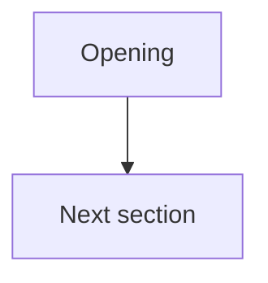

# Article architecture maps

Status: required visual control surface for every registered Joel article family.

## Purpose

Long-form article work can accumulate enough owner-final passages, section moves, setup/payoff dependencies, detector repairs, source pools, and cross-article links that prose state alone becomes expensive to reconstruct after context loss. Each article therefore keeps one source-controlled Mermaid architecture map, and the repository keeps one meta-map across articles.

The maps are visual indexes over authority. They do **not** outrank `articles/INDEX.json`, article current state, owner locks, the registered master, or source/evidence records. If a graph conflicts with canonical state, repair the graph.

## Per-article map

Every registered article must contain:

`articles/<article-id>/ARCHITECTURE.md`

and register it in `additional_artifacts` with:

```json
{
  "role": "architecture_map",
  "path": "articles/<article-id>/ARCHITECTURE.md",
  "sha256": "<lowercase SHA-256>"
}
```

The map must contain exactly one marker:

```html
<!-- article-id: <article-id> -->
```

and at least one plain GitHub-compatible Mermaid fence:

````markdown

````

Do not add attributes to the code fence. Keep labels quoted and syntax conservative so GitHub renders the same graph a worker sees in source.

### What the article map should show

At minimum, show:

- H1/H2 order at the level needed to understand the article's movement;
- the protected job of each consequential section;
- non-linear setup → payoff dependencies that would be easy to orphan;
- important source/owner-final/supersession routing when it affects placement;
- unresolved placement questions that materially constrain editing;
- the true terminal stopping point;
- the canonical state/master the graph indexes.

For a long article, use an overview plus focused drill-down graphs in the same file. Do not create a paragraph-by-paragraph mega-graph.

### Required update triggers

Update the article map in the same substantive change when any of these materially change:

- section order or heading identity;
- a protected rhetorical function moves;
- an owner-final correction supersedes a prior candidate in a way that changes routing;
- a setup/payoff dependency is added, removed, or rerouted;
- a section is deleted, split, merged, or relocated;
- the real stopping point changes;
- a detector-driven repair exposes a topology problem rather than only local wording.

Cosmetic wording edits do not require graph churn.

Before moving or deleting a passage, inspect the graph and identify where every protected function lands. If any function would become orphaned, the move is blocked until the owner explicitly drops that function or a destination is established.

## Repository article meta-map

`articles/ARTICLE-META-MAP.md` is the canonical repository-wide visual map. It is a reserved physical repository file and exists even while the article registry is empty.

Every registered article must appear exactly once via:

```html
<!-- article-id: <article-id> -->
```

The Mermaid graph should make useful relationships visible, including:

- explicit article → article links;
- one article providing detail/evidence that another should link to instead of repeating;
- overlapping claims or examples that deserve a deduplication audit;
- conceptual prerequisites or natural reading paths;
- potential interlink opportunities discovered during editing;
- deliberate separations where similar subjects should not be conflated.

The meta-map is editorially maintained. Do not infer edges mechanically from shared keywords; a link/dedup edge is a semantic judgment.

### Meta-map update triggers

Update the meta-map in the same change when:

- an article is registered, removed, renamed, or archived;
- a durable cross-article link is added or removed;
- article work reveals material duplicate coverage;
- one article becomes the natural canonical destination for detail another article currently repeats;
- a new interlink opportunity is accepted as part of the editorial architecture.

## Humanization / detector use

A detector-red window does not authorize local paraphrasing before the article map is checked. The red window may be a symptom of wrong placement, duplicated realization, orphaned setup/payoff logic, or a governing thought that belongs elsewhere.

After any detector-driven edit that changes more than local wording:

1. re-run semantic sanity on the exact thought;
2. inspect the affected graph node and immediate dependencies;
3. update the graph if topology/function changed;
4. re-run the article-wide architecture gate;
5. only then treat detector status as secondary evidence.

## Validation

`scripts/validate_article_architecture_maps.py` fails closed when:

- `articles/ARTICLE-META-MAP.md` is missing or symlinked;
- the meta-map lacks a plain `mermaid` fence;
- a registered article is missing from the meta-map marker set;
- a registered article lacks exactly one `architecture_map` artifact;
- that artifact is not `articles/<id>/ARCHITECTURE.md`;
- the article map lacks its exact article-id marker or a plain Mermaid fence.

The structural validator intentionally does not parse full Mermaid semantics. A renderer check can catch syntax errors; editorial review must still verify that the arrows and jobs are true.

## Import and new-article rule

Every article creation/import task must, in the same change:

1. create the article-local `ARCHITECTURE.md` from `templates/ARTICLE-ARCHITECTURE.md`;
2. register its hash as the `architecture_map` artifact;
3. add the article marker/node to `articles/ARTICLE-META-MAP.md`;
4. add known cross-article relationships without inventing speculative links;
5. run structural validation plus the ordinary article authority gates.

A worker must not consider an article family complete enough to register until both map layers exist.
