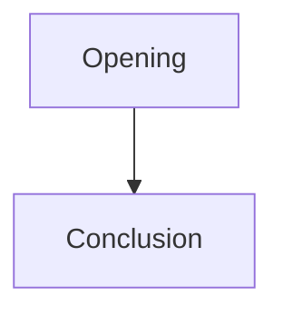
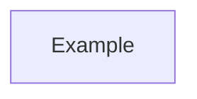
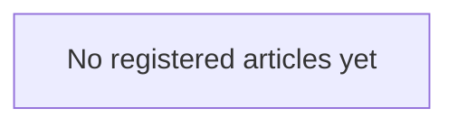

# Article Mermaid Architecture Implementation Plan

> **For agentic workers:** REQUIRED SUB-SKILL: Use superpowers:subagent-driven-development (recommended) or superpowers:executing-plans to implement this plan task-by-task. Steps use checkbox (`- [ ]`) syntax for tracking.

**Goal:** Require one canonical Mermaid architecture map per registered article plus one repository-wide article meta-map, with fail-closed validation and private Romance bootstrap mapping.

**Architecture:** Keep Mermaid maps as non-authoritative visual indexes over registered prose/evidence. Enforce their presence, location, article-id markers, and plain GitHub-compatible Mermaid fences in the existing content validator. Keep the repository meta-map as a reserved top-level article file; keep Romance's actual map private until formal article import.

**Tech Stack:** Python 3 standard library, unittest, Markdown/Mermaid, existing GitHub Actions content-integrity gate.

## Global Constraints

- Never move private Romance prose into public `joel-articles` merely to satisfy mapping.
- Mermaid fences must be plain ` ```mermaid ` with no attributes.
- Maps do not override article authority, owner locks, or current state.
- Per-article map updates are required only for material topology/function/authority-routing changes, not cosmetic wording edits.
- Meta-map relationships are semantic/editorial judgments, not automatically inferred from keywords.

---

### Task 1: Specify map validation behavior

**Files:**
- Modify: `tests/test_validate_content_repository.py`

**Interfaces:**
- Consumes: `validate_repository(root: Path) -> list[dict[str, str]]`
- Produces: regression expectations for `article.architecture.*` and `index.meta-map.*` findings.

- [ ] **Step 1: Extend the valid article fixture with `articles/example/ARCHITECTURE.md` registered as `additional_artifacts` role `architecture_map`, and create `articles/ARTICLE-META-MAP.md` in active-repository tests.**

Use a minimal valid map:

```markdown
# Example architecture

<!-- article-id: example -->


```

Use a minimal valid meta-map:

```markdown
# Article meta-map

<!-- article-id: example -->


```

- [ ] **Step 2: Add failing tests requiring:**

```python
def test_active_article_requires_exactly_one_architecture_map_artifact(): ...
def test_architecture_map_must_use_canonical_path(): ...
def test_architecture_map_requires_matching_marker_and_plain_mermaid_fence(): ...
def test_repository_requires_article_meta_map(): ...
def test_meta_map_must_be_physical_file(): ...
def test_meta_map_requires_plain_mermaid_fence(): ...
def test_meta_map_must_include_every_registered_article(): ...
```

- [ ] **Step 3: Run the focused tests before validator changes.**

Run:

```bash
python -m unittest tests.test_validate_content_repository -v
```

Expected: new architecture/meta-map tests fail because the validator has no such rules yet.

### Task 2: Implement minimal validator support

**Files:**
- Modify: `scripts/validate_content_repository.py`
- Test: `tests/test_validate_content_repository.py`

**Interfaces:**
- Add constants `ARTICLE_META_MAP_PATH = "articles/ARTICLE-META-MAP.md"` and `ARCHITECTURE_ROLE = "architecture_map"`.
- Add `_has_plain_mermaid_fence(text: str) -> bool`.
- Add `_validate_article_architecture(root, article_id, additional_artifacts) -> findings`.
- Add `_validate_article_meta_map(root, repository_status, articles) -> findings`.

- [ ] **Step 1: Implement plain-fence detection** using literal `"```mermaid\n"` and reject only missing structural fence; do not add a Mermaid dependency.

- [ ] **Step 2: Implement per-article architecture validation.** Require exactly one additional artifact with role `architecture_map`; safe path must equal `articles/<article-id>/ARCHITECTURE.md`; the referenced file must include `<!-- article-id: <article-id> -->` and a plain Mermaid fence.

- [ ] **Step 3: Implement meta-map validation.** Require the physical reserved file, plain Mermaid fence, and one marker for every registered article. Allow zero markers in governance-incubator state.

- [ ] **Step 4: Add `articles/ARTICLE-META-MAP.md` to reserved article files** so it does not count as unregistered family content and symlinks are rejected.

- [ ] **Step 5: Run focused tests.**

```bash
python -m unittest tests.test_validate_content_repository -v
```

Expected: all focused tests pass.

### Task 3: Add governance docs, template, and bootstrap meta-map

**Files:**
- Create: `docs/ARTICLE-ARCHITECTURE-MAPS.md`
- Create: `templates/ARTICLE-ARCHITECTURE.md`
- Create: `articles/ARTICLE-META-MAP.md`
- Modify: `articles/AGENTS.md`
- Modify: `docs/INDEX.md`
- Modify: `docs/CONTENT-AUTHORITY-AND-IMPORT.md`

**Interfaces:**
- `ARTICLE-ARCHITECTURE-MAPS.md` is the normative map protocol.
- `templates/ARTICLE-ARCHITECTURE.md` is the copyable per-article starting point.
- `ARTICLE-META-MAP.md` is the canonical repository-wide visual map.

- [ ] **Step 1: Add the protocol** covering purpose, authority limits, update triggers, article-local requirements, meta-map relationships, and anti-mega-graph guidance.

- [ ] **Step 2: Add a conservative GitHub-renderable template** using only `flowchart`, quoted labels, simple arrows, and optional dotted dependency arrows.

- [ ] **Step 3: Add the empty-incubator meta-map:**



- [ ] **Step 4: Update article instructions/import protocol/index** so every article creation/import task is explicitly told to create/register `ARCHITECTURE.md` and add the article to `ARTICLE-META-MAP.md` in the same change.

- [ ] **Step 5: Run full repository verification.**

```bash
python -m unittest discover -s tests -v
python scripts/validate_content_repository.py --root .
python scripts/audit_codex_github.py --root . --fail-on error
```

Expected: tests and validators pass with the repository still truthfully marked as an empty governance incubator.

### Task 4: Add the current private Romance architecture map

**Repository:** `u-dont-existDOTcom/pangram-humanization-lab`
**Branch:** `agent/romance-architecture-map-2026-08-16`, based on the current Romance assembly branch.

**Files:**
- Create: `work/romance-current-assembly/ARCHITECTURE.md`

**Interfaces:**
- The map indexes the current private assembled Romance candidate and owner/detector replacement state; it is not canonical public article authority.

- [ ] **Step 1: Create an overview graph** showing H1 order from opening through Tough Love, with compact section-job labels.

- [ ] **Step 2: Add focused drill-downs** for (a) love/agape dependencies, (b) community relationships across Two Pillars / If already in it / Children / Ending / Tough Love, and (c) final loss → Tough Love → Bear/Rumi closing.

- [ ] **Step 3: Record current authority notes** for Aug. 16 Psychedelics, `If you're already in it`, Tough Love, and the Bear/Rumi terminal close so stale assistant candidates cannot be mistaken for current topology.

- [ ] **Step 4: Do not change article prose in this task.** The graph reflects current authority; assembly updates remain a separate operation.

### Task 5: Close out the Tough Love owner correction

**Repository:** `u-dont-existDOTcom/pangram-humanization-lab`

**Files:**
- Update the current Aug. 16 Tough Love detector-repair record.

- [ ] **Step 1: Replace the tested typo `But pathology it festers...` with Joel's owner-final `But pathology festers...`.**

- [ ] **Step 2: Record that Joel retested the correction and reports the section remains fully Human / High confidence.** Do not invent a numeric percentage or result id.

- [ ] **Step 3: Preserve the supplied Pangram 4.0 PDF as the exact pre-repair detector evidence:** 689 words, 76.2% Human / 23.8% AI, with 98-word and 66-word Fully AI / High confidence windows.

- [ ] **Step 4: Re-read the final section for semantic/coherence regression; no additional paid Pangram call unless a new unresolved detector question remains.
