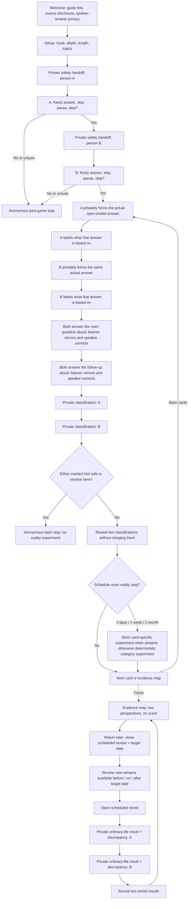
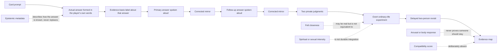
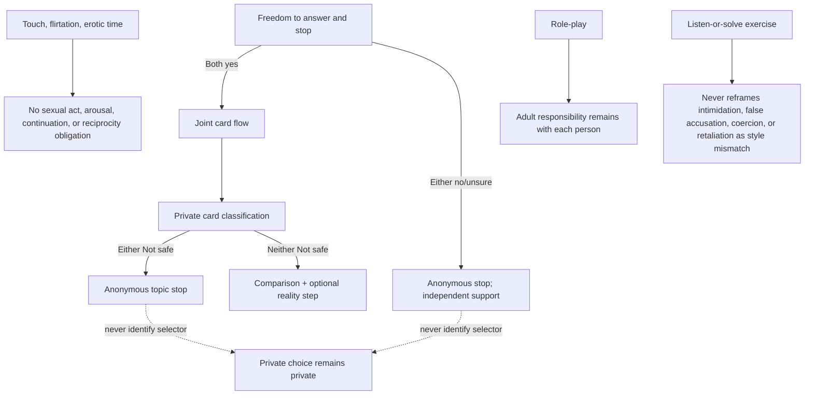
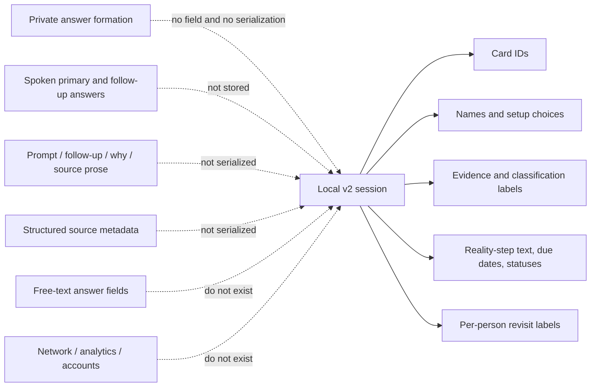
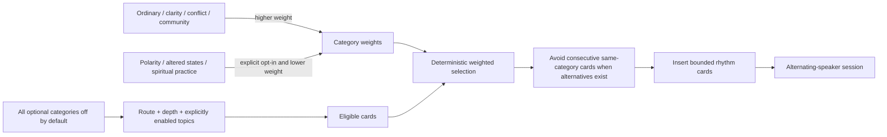
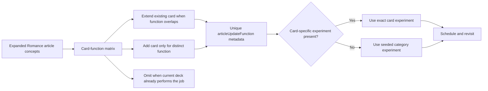
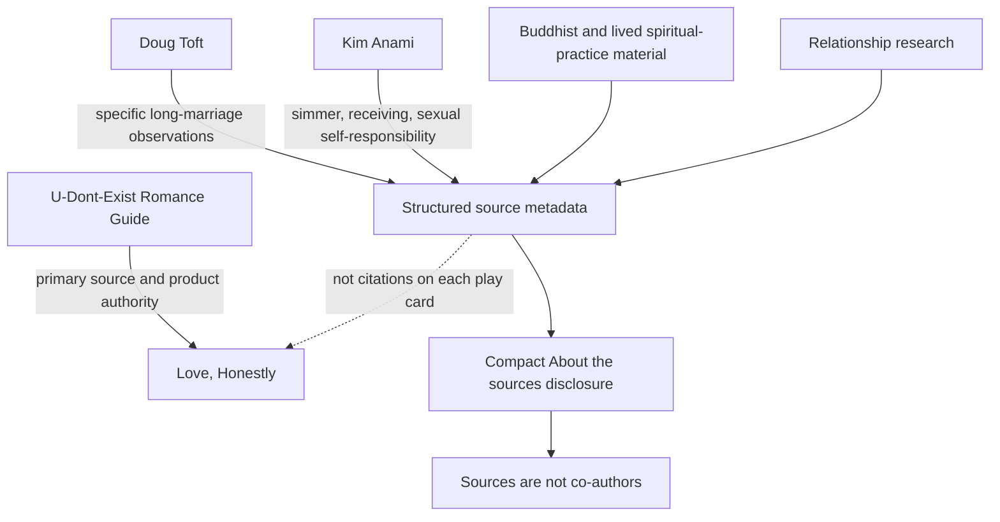

# Love, Honestly v0.3.2 Game Architecture

This is the canonical operational map for the standalone game. Update it whenever a consequential phase, safety exit, serialized record, category default, source boundary, or setup-to-revisit dependency changes.

## Player flow

## Answer and epistemic dependency

## Safety routing

## Stored-data boundary

## Selection architecture

## Card-function and experiment architecture

## Source and authority architecture

## Backward recovery

- Legacy v0.3.0 `discuss` state renders as the new primary spoken-answer phase.
- Existing `private-evidence-*` phases remain readable rather than corrupting or discarding a saved session.
- New sessions always pass through `private-answer-*` before `private-evidence-*`.
- Card IDs and local-storage schema version 2 remain unchanged.

## Authority and invariants

- The exact first-screen link remains `Based on the U-Dont-Exist Romance Guide` → `https://romance.u-dont-exist.com`.
- Joel’s guide remains the product authority; additional credits do not imply joint authorship.
- The actual open-ended answer is a first-class phase and is spoken aloud; evidence labels are secondary metadata.
- The card-function matrix governs extend/add/omit decisions and blocks paragraph-by-paragraph deck inflation.
- Existing card IDs and storage schema v2 remain stable.
- Two private classifications and two private revisit records remain separate.
- A safety stop remains anonymous.
- Reality steps are overt. Card-specific experiments override category fallbacks; secret tests are prohibited.
- Sexual, flirtation, receiving, rank, role-play, and spiritual cards preserve the explicit non-obligation and abuse boundaries.
- A scheduled reality plan becomes complete only after both people submit a revisit.
- The target date is a reminder target, not an access lock. Pending reviews are surfaced on the welcome screen with the scheduled date and an explicit `Review now` action at all times.
- No compatibility score may be added without an explicit product-authority change.
- No answer field, spoken answer, card prose, or source metadata enters serialized session data.
- The application makes no automatic external request; the Romance Guide link is user-initiated navigation only.
