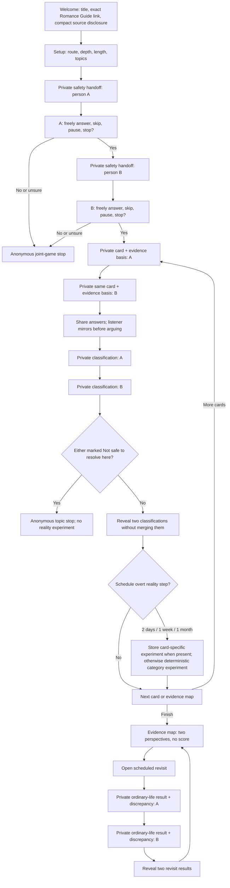
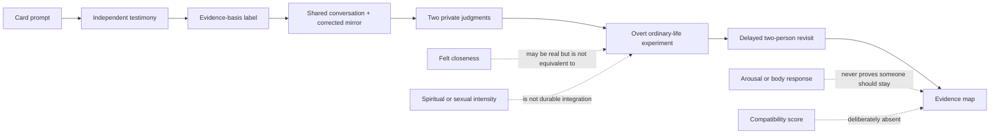
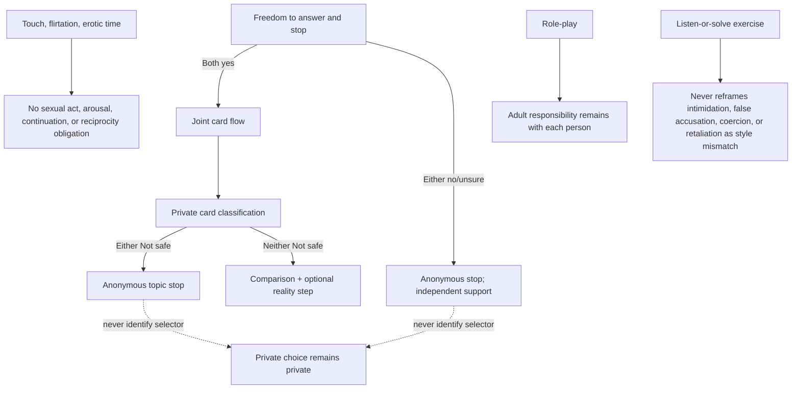
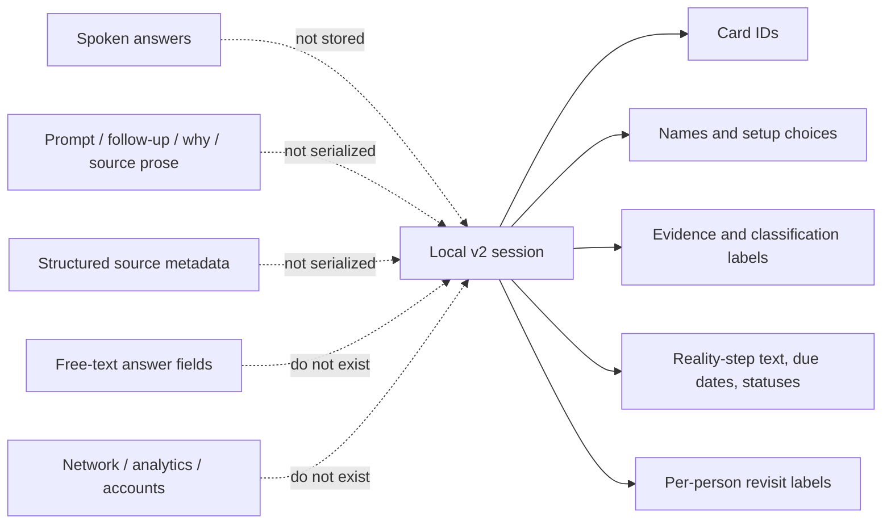
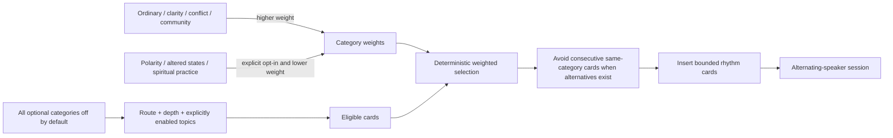
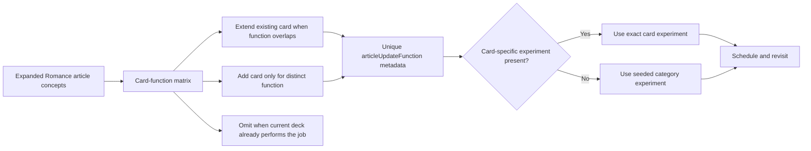
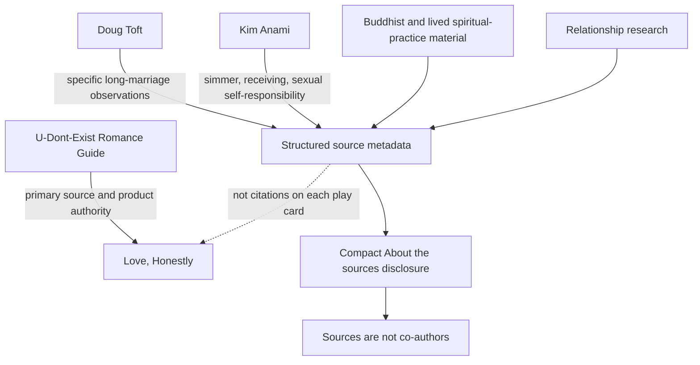

# Love, Honestly v0.3.0 Game Architecture

Status: durable private product-architecture snapshot for the released standalone game. This branch is intentionally not merged into the article-governance `main` branch. The complete project history is carried by the verified Git bundle.

This is the canonical operational map. Update it whenever a consequential phase, safety exit, serialized record, category default, source boundary, or setup-to-revisit dependency changes.

## Player flow

## Epistemic dependency

## Safety routing

## Stored-data boundary

## Selection architecture

## Card-function and experiment architecture

## Source and authority architecture

## Non-negotiable invariants

- The exact first-screen link remains `Based on the U-Dont-Exist Romance Guide` → `https://romance.u-dont-exist.com`.
- Joel’s guide remains the product authority; additional credits do not imply joint authorship.
- The card-function matrix governs extend/add/omit decisions and blocks paragraph-by-paragraph deck inflation.
- Existing v0.2.1 card IDs and storage schema v2 remain stable.
- Two private classifications and two private revisit records remain separate.
- A safety stop remains anonymous.
- Reality steps are overt. Card-specific experiments override category fallbacks; secret tests are prohibited.
- Sexual, flirtation, receiving, rank, role-play, and spiritual cards preserve the explicit non-obligation and abuse boundaries.
- A scheduled reality plan becomes complete only after both people submit a revisit.
- No compatibility score may be added without an explicit product-authority change.
- Spoken answers, card prose, and source metadata remain outside serialized session data.
- The application makes no automatic external request; the Romance Guide link is user-initiated navigation only.
