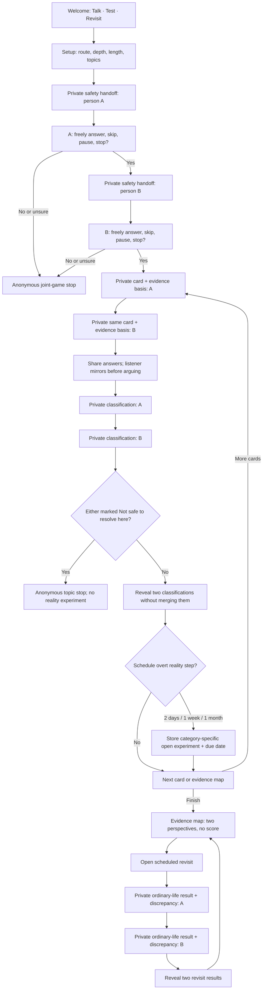
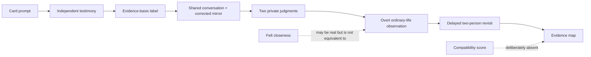
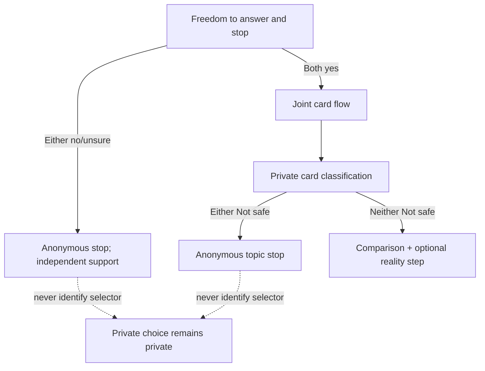
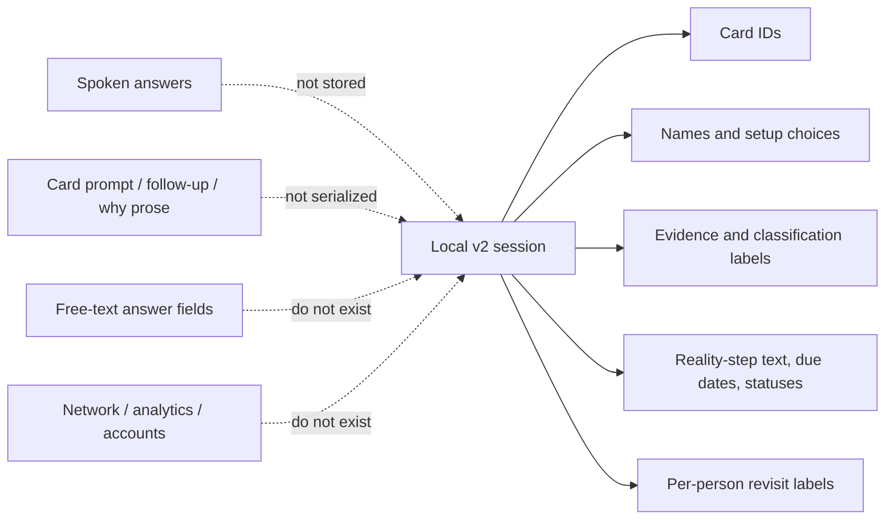
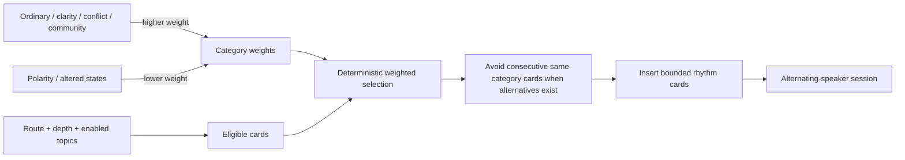

# Love, Honestly v0.2.0 Game Architecture

Status: durable private product-architecture snapshot for the released standalone game.

This branch is intentionally not merged into the article-governance `main` branch. A future dedicated game repository should import this directory together with the full Git bundle. The map is an operational control surface, not authority to alter Joel's article.

## Core invariant

A deep answer is testimony, not proof. Preserve this sequence:

**Talk → identify evidence basis → preserve two private judgments → test openly in ordinary life → revisit privately → compare without scoring.**

Do not revert to v0.1's single negotiated outcome model.

## Player flow

## Epistemic dependency

## Safety routing

## Stored-data boundary

## Selection architecture

## Article-to-product corrections encoded

- A successful card session can create real closeness without proving ordinary compatibility.
- Mutual triggering and unilateral coercion are not the same problem.
- Modern courtship often lacks a contained intermediate stage before sex and entanglement; the game explores the missing form without presenting historical bundling as a proven solution.
- Labels do not manufacture commitment, but naming an arrangement can expose incompatible assumptions.
- Consent cannot be negotiated on MDMA as though sober; altered-state intimacy still requires later sober evidence.

## Non-negotiable invariants

- Two private classifications and two private revisit records remain separate.
- A safety stop remains anonymous.
- Reality steps are overt, category-specific, and never secret tests.
- A scheduled reality plan becomes complete only after both people submit a revisit.
- No compatibility score may be added without an explicit product-authority change.
- Spoken answers and card prose remain outside serialized session data.
- Ordinary life, clarity, conflict, community, trust, promises, children, and life design carry more selection weight than optional polarity or altered-state material.
- Article-specific claims, autobiography, evidence, and rhetoric remain in the article rather than being silently generalized by the game.
