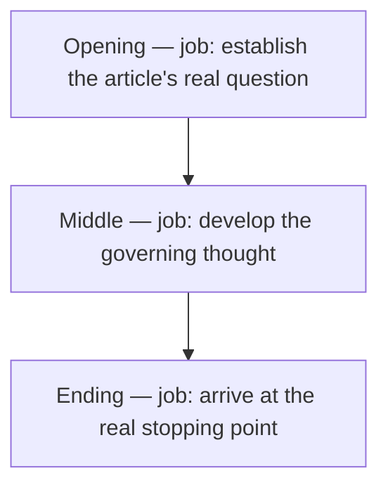
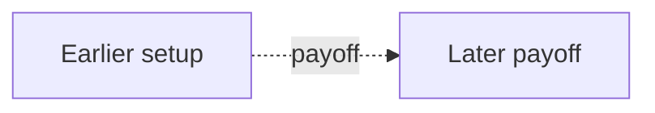

# <Article title> architecture

<!-- article-id: <article-id> -->

Indexes: `<current-state path>` + `<registered master path>`

This graph is a visual index over canonical article state. If it conflicts with registered authority, repair the graph.

## Overview

## Important dependencies

## Authority / placement notes

- Current owner-final topology: describe only placement/authority facts that affect the graph.
- Superseded routing: name old candidates only when a fresh worker could otherwise mistake them for current authority.
- Unresolved placement questions: list only live questions; remove them when resolved.
- Protected functions: ensure every consequential function in `OWNER-LOCKS.json` has a visible destination when placement matters.

## Update rule

Update this file in the same substantive change whenever section order, protected-function placement, owner supersession routing, setup/payoff dependencies, or the real stopping point changes. Cosmetic prose edits do not require graph churn.
